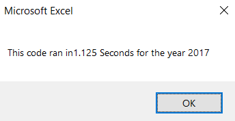

# VBA of Wall Street " Stocks Analysis "

## Overview of Project

	Project Name: "Stock Analysis for Steve's Parents' Investment"

	Issue:		Analyze a large set of data containing information related to starting closing prices and ending closing prices for different stocks for the years "2017" and "2018".

	Goal:		Determine if "DQ" is a good investment choice. If not, provide Steve's parents with the best option by determining total volumes for different stocks, and the gain margins for years "2017" and "2018"

## Purpose

	The purpose of this project is to learn how to refactor a previous version of a code, and identify the different ways how given code can be improved to execute tasks in a timely manner.

## Results

	After completing the refactoring process, it is clear that execution times improved significantly. In both cases - stock analysis 2017 and 2018 -  it can be noted that the tasks were completed in almost 10 times less than with the original code.

	For the 2017 analysis, with the original code, it took 1.125 seconds to complete the task. Whereas with the refactored code, it only took 0.1132 seconds.

	The same scenario is repeated for the 2018 analysis. It took 1.0546 seconds to complete the task, while the refactored code completed it in only 0.1132 seconds

 

	Such improvement, it is only attributed to the refactoring process. It started with determining “tickerIndex = 0” which helped to access the different arrays that were created in the refactored code. In addition, what was different from the original code, is that three output arrays were accessed using “For Loops”, these arrays are : “tickerVolumes”, “tickerStartingPrices”, and “tickerEndingPrices”.

	Another factor that improved the execution times, was how the “For Loops” accessed the arrays and extracted the data needed to complete the tasks. Accessing one ticker at a time by comparing the first and the last row for that ticker. If both conditions complied with the statement, then, the “For Loop” moved to the next ticker and increased the count for that ticker.

	Finally, the refactored code, looped through all the arrays to display the results in our table, just like the original code did. But in this case, the fact that a “For Loop” was used to display that data, helped to improved to execution time.

##Summary
	
 	Refactoring code has a lot of advantages given the fact that allows to restructure the main code without altering the functionality of it. It also helps developers to remove redundancies within the code that will allow the program to avoid unnecessary tasks. That will cause that, in many cases, the refactored code will look shorter and will provide developers with better options to test it. However, one of the disadvantages of refactoring, is that it can introduce new bugs and errors if it is not done properly; it can also be counterproductive when a large team is working on a single project. Another “disadvantage” is that, in many cases, the final customer cannot really appreciate the difference between the original or refactored code since both execute the tasks as required.

	In regards to our VBA script, it is clear that the refactored code is shorter, completes more tasks than the original one with less subroutines, and it executes the tasks faster than the code developed during module 2. However, One of the disadvantages that the refactored code presents is that, it can be difficult to understand for someone who has little to no experience in the field, or does not understand what the code tries to accomplish.
	

